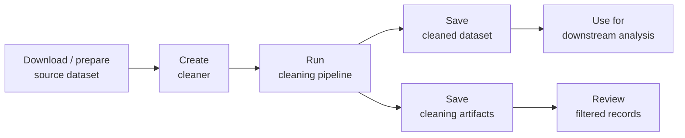

# Data Cleaners Usage Guide

## Overview

This guide provides usage examples for data cleaning modules organized by dataset source:

- [**Human Domainome Dataset**](#human-domainome-dataset): Site-saturation mutagenesis of 500 human protein domains.
- [**ProteinGym DMS Substitutions Dataset**](#proteingym-dms-substitutions-dataset): Large-scale benchmarks for protein design and fitness prediction.
- [**cDNA Proteolysis Dataset**](#cdna-proteolysis-dataset): Mega-scale experimental analysis of protein folding stability in biology and design.
- [**ddG Dataset**](#ddg-dataset): A collection of datasets providing single- and multiple-mutant measurements, labeled by the thermodynamic parameter ΔΔG.
- [**dTm Dataset**](#dtm-dataset): A collection of datasets providing single- and multiple-mutant measurements, labeled by the thermodynamic parameter ΔTm.
- [**ArchStabMS1E10 Epistasis Dataset**](#archstabms1e10-epistasis-dataset): High-order multi-mutant libraries (“1e10”) measuring protein stability for GRB2-SH3 and SRC.
- [**Antitoxin ParD3 Epistasis Dataset**](#antitoxin-pard3-epistasis-dataset): The antitoxin ParD3 3-position library is a combinatorially exhaustive dataset of 8,000 variants demonstrating that simple, independent per-residue mutation preferences are sufficient to almost perfectly predict combinatorial protein fitness.
- [**TrpB Epistasis Dataset**](#trpb-epistasis-dataset): A combinatorially complete sequence-fitness landscape comprising 160,000 variants across four active-site residues of the enzyme tryptophan synthase, capturing significant epistatic interactions to serve as a benchmark for model-guided enzyme engineering.
- [**Human Myoglobin Epistasis Dataset**](#human-myoglobin-epistasis-dataset): A deep mutational scanning library detailing the expression fitness scores for near-comprehensive single-codon mutations and a small fraction of double-codon mutations in yeast surface-displayed human myoglobin, which was used to train machine learning models for predicting epistatic effects and discovering stability-enhancing variants.
- [**CTXM Epistasis Dataset**](#ctxm-epistasis-dataset): A large-scale pairwise deep mutational scanning dataset of the CTX-M-14 β-lactamase active site, covering 49,096 double mutants across 17 active-site residues. Fitness measurements were obtained from functional selection under ampicillin and cefotaxime, providing substrate-dependent fitness landscapes for studying epistasis, compensatory mutations, and antibiotic resistance prediction.
- [**RBD-ACE2 Dataset**](#rbd-ace2-dataset): SARS-CoV-2 RBD sequences with ACE2 binding affinity scores, labeled by `log10Ka` where higher values indicate stronger ACE2 binding affinity.
- [**RBD-Antibody Dataset**](#rbd-antibody-dataset): SARS-CoV-2 RBD antibody escape data with `score` computed as the negative logarithm of escape. Higher scores indicate weaker escape, reflecting better binding capacity.

---

## Installation

```bash
pip install mutcleaner
```

---


## Common Workflow

### Workflow Overview


### Workflow Steps

Most dataset cleaners follow the same workflow:

1. Download or prepare the source dataset.
2. Create a dataset-specific cleaning pipeline with `create_*_cleaner`.
3. Run the cleaning pipeline with `clean_*_dataset`.
4. Save the cleaned standardized dataset.
5. Save cleaning artifacts for reproducibility.
6. Optionally export cleaning artifacts to CSV files for inspection.

### Returned Objects

The cleaning process usually returns two objects:

- `cleaning_pipeline`: the fitted cleaning pipeline, including intermediate cleaning artifacts.
- `cleaned_dataset`: the standardized cleaned dataset that can be saved and used for downstream analysis.


---

## Supported Datasets

### Human Domainome Dataset

#### File Preparation
You can download the source file directly by running (see {py:func}`mutcleaner.utils.download_human_domainome_source_file` for details):
```python
from mutcleaner import download_human_domainome_source_file

file_path = download_human_domainome_source_file("dataset/Human_Domainome_Dataset")
```

#### Basic Usage

**Cleaning Pipeline**

```python
import pickle
from pathlib import Path
from mutcleaner.cleaners import (
    create_human_domainome_sup2_cleaner,
    clean_human_domainome_sup2_dataset,
)

# File settings
dataset_file_path = Path("../dataset/Human_Domainome_Dataset/SupplementaryTable2.txt")
artifact_path = Path("../logs/Human_Domainome_Dataset/artifacts.pkl")
artifact_csv_dir = Path("../logs/Human_Domainome_Dataset")

artifact_csv_dir.mkdir(parents=True, exist_ok=True)

# Clean data
hd_cleaning_pipeline = create_human_domainome_sup2_cleaner(dataset_file_path)
hd_cleaning_pipeline, hd_dataset = clean_human_domainome_sup2_dataset(
    hd_cleaning_pipeline
)

# Save data
hd_dataset.save("../outputs/cleaned_Human_Domainome_Dataset")
hd_cleaning_pipeline.save_artifacts(artifact_path)

# Load cleaning artifacts and read the object
with open(artifact_path, "rb") as file:
    artifacts = pickle.load(file)

for artifact_name, artifact_df in artifacts.items():
    artifact_df.to_csv(artifact_csv_dir / f"{artifact_name}.csv", index=False)
```

#### Advanced Settings

See {py:class}`mutcleaner.cleaners.HumanDomainomeSup2CleanerConfig` for details.

### ProteinGym DMS Substitutions Dataset

#### File Preparation
You can download the source file directly by running (see {py:func}`mutcleaner.utils.download_proteingym_source_file` for details):
```python
from mutcleaner import download_proteingym_source_file

file_paths = download_proteingym_source_file("../dataset/ProteinGym_DMS_Substitutions_Dataset")
```

#### Basic Usage

**Cleaning Pipeline**

```python
import pickle
from pathlib import Path
from mutcleaner.cleaners import (
    create_proteingym_dms_substitutions_cleaner,
    clean_proteingym_dms_substitutions_dataset,
)

# File settings
dataset_file_path = Path("../dataset/ProteinGym_DMS_Substitutions_Dataset/ProteinGym_DMS_substitutions.zip")
artifact_path = Path("../logs/ProteinGym_DMS_Substitutions_Dataset/artifacts.pkl")
artifact_csv_dir = Path("../logs/ProteinGym_DMS_Substitutions_Dataset")

artifact_csv_dir.mkdir(parents=True, exist_ok=True)

# Clean data
pg_cleaning_pipeline = create_proteingym_dms_substitutions_cleaner(dataset_file_path)
pg_cleaning_pipeline, pg_dataset = clean_proteingym_dms_substitutions_dataset(
    pg_cleaning_pipeline
)

# Save data
pg_dataset.save("../outputs/cleaned_ProteinGym_DMS_Substitutions_Dataset")
pg_cleaning_pipeline.save_artifacts(artifact_path)

# Load cleaning artifacts and read the object
with open(artifact_path, "rb") as file:
    artifacts = pickle.load(file)

for artifact_name, artifact_df in artifacts.items():
    artifact_df.to_csv(artifact_csv_dir / f"{artifact_name}.csv", index=False)
```

#### Advanced Settings

See {py:class}`mutcleaner.cleaners.ProteinGymCleanerConfig` for details.

### cDNA Proteolysis Dataset

#### File Preparation
You can download the source file directly by running (see {py:func}`mutcleaner.utils.download_cdna_proteolysis_source_file` for details):
```python
from mutcleaner import download_cdna_proteolysis_source_file

file_paths = download_cdna_proteolysis_source_file("path/to/target/folder")
```

#### ΔΔG as Label (Default Pipeline)

**Cleaning Pipeline**

```python
import pickle
from pathlib import Path
from mutcleaner.cleaners import (
    create_cdna_proteolysis_cleaner,
    clean_cdna_proteolysis_dataset,
)

# File settings
dataset_file_path = Path("../dataset/cDNA_Proteolysis_Dataset/Tsuboyama2023_Dataset2_Dataset3_20230416.csv")
artifact_path = Path("../logs/cDNA_Proteolysis_ddG_Dataset/artifacts.pkl")
artifact_csv_dir = Path("../logs/cDNA_Proteolysis_ddG_Dataset")

artifact_csv_dir.mkdir(parents=True, exist_ok=True)

# Clean data
cdna_cleaning_pipeline = create_cdna_proteolysis_cleaner(dataset_file_path)
cdna_cleaning_pipeline, cdna_dataset = clean_cdna_proteolysis_dataset(
    cdna_cleaning_pipeline
)

# Save data
cdna_dataset.save("../outputs/cleaned_cDNA_Proteolysis_ddG_Dataset")
cdna_cleaning_pipeline.save_artifacts(artifact_path)

# Load cleaning artifacts
with open(artifact_path, "rb") as file:
    artifacts = pickle.load(file)

for artifact_name, artifact_df in artifacts.items():
    artifact_df.to_csv(artifact_csv_dir / f"{artifact_name}.csv", index=False)
```

#### ΔG as Label

**Cleaning Pipeline**
```python
import pickle
from pathlib import Path
from mutcleaner.cleaners import (
    CDNAProteolysisCleanerConfig,
    create_cdna_proteolysis_cleaner,
    clean_cdna_proteolysis_dataset,
)

# Set cleaning configs
cdna_cleaning_config = CDNAProteolysisCleanerConfig()
cdna_cleaning_config.column_mapping = {
    "WT_name": "name",
    "aa_seq": "mut_seq",
    "mut_type": "mut_info",
    "dG_ML": "label_cDNAProteolysis",
}
# File settings
dataset_file_path = Path("../dataset/cDNA_Proteolysis_Dataset/Tsuboyama2023_Dataset2_Dataset3_20230416.csv")
artifact_path = Path("../logs/cDNA_Proteolysis_dG_Dataset/artifacts.pkl")
artifact_csv_dir = Path("../logs/cDNA_Proteolysis_dG_Dataset")

artifact_csv_dir.mkdir(parents=True, exist_ok=True)

# Clean data
cdna_cleaning_pipeline = create_cdna_proteolysis_cleaner(dataset_file_path, cdna_cleaning_config)
cdna_cleaning_pipeline, cdna_dataset = clean_cdna_proteolysis_dataset(
    cdna_cleaning_pipeline
)

# Save data
cdna_dataset.save("../outputs/cleaned_cDNA_Proteolysis_dG_Dataset")
cdna_cleaning_pipeline.save_artifacts(artifact_path)

# Load cleaning artifacts
with open(artifact_path, "rb") as file:
    artifacts = pickle.load(file)

for artifact_name, artifact_df in artifacts.items():
    artifact_df.to_csv(artifact_csv_dir / f"{artifact_name}.csv", index=False)
```

#### Advanced Settings
See {py:class}`mutcleaner.cleaners.CDNAProteolysisCleanerConfig` for details.

### ddG Dataset

#### File Preparation

You can download the source file directly by running (see {py:func}`mutcleaner.utils.download_ddg_dtm_source_file` for details):
```python
from mutcleaner import download_ddg_dtm_source_file

# Download all datasets
file_paths = download_ddg_dtm_source_file("../dataset/ddG_Dataset")

# Or specify a particular dataset, e.g.
file_path = download_ddg_dtm_source_file("../dataset/ddG_Dataset", sub_dataset="S461")
```

#### Basic Usage

{py:func}`mutcleaner.cleaners.ddg_dtm_cleaners.create_ddg_dtm_cleaner` can automatically recognize the label column ddG. For example:

```python
from pathlib import Path
import pickle
from mutcleaner.cleaners import create_ddg_dtm_cleaner, clean_ddg_dtm_dataset

# File settings
dataset_file_path = Path("../dataset/ddG_Dataset/S461.csv")
artifact_path = Path("../logs/ddG_Dataset/artifacts.pkl")
artifact_csv_dir = Path("../logs/ddG_Dataset")

artifact_csv_dir.mkdir(parents=True, exist_ok=True)

# Clean data
ddgdtm_cleaning_pipeline = create_ddg_dtm_cleaner(dataset_file_path)
ddgdtm_cleaning_pipeline, ddgdtm_dataset = clean_ddg_dtm_dataset(
    ddgdtm_cleaning_pipeline
)

# Save data
ddgdtm_dataset.save("../outputs/cleaned_ddG_Dataset/S461")
ddgdtm_cleaning_pipeline.save_artifacts(artifact_path)

# Load cleaning artifacts
with open(artifact_path, "rb") as file:
    artifacts = pickle.load(file)

for artifact_name, artifact_df in artifacts.items():
    artifact_df.to_csv(artifact_csv_dir / f"{artifact_name}.csv", index=False)
```

#### Advanced Settings

See {py:class}`mutcleaner.cleaners.DdgDtmCleanerConfig` for details.

### dTm Dataset

#### File Preparation

You can download the source file directly by running (see {py:func}`mutcleaner.utils.download_ddg_dtm_source_file` for details):
```python
from mutcleaner import download_ddg_dtm_source_file

# Download all datasets
file_paths = download_ddg_dtm_source_file("../dataset/dTm_Dataset")

# Or specify a particular dataset, e.g.
file_path = download_ddg_dtm_source_file("../dataset/dTm_Dataset", sub_dataset="S571")
```

#### Basic Usage

{py:func}`mutcleaner.cleaners.ddg_dtm_cleaners.create_ddg_dtm_cleaner` can automatically recognize the label column dTm. For example:

```python
from pathlib import Path
import pickle
from mutcleaner.cleaners import create_ddg_dtm_cleaner, clean_ddg_dtm_dataset

# File settings
dataset_file_path = Path("../dataset/dTm_Dataset/S571.csv")
artifact_path = Path("../logs/dTm_Dataset/artifacts.pkl")
artifact_csv_dir = Path("../logs/dTm_Dataset")

artifact_csv_dir.mkdir(parents=True, exist_ok=True)

# Clean data
ddgdtm_cleaning_pipeline = create_ddg_dtm_cleaner(dataset_file_path)
ddgdtm_cleaning_pipeline, ddgdtm_dataset = clean_ddg_dtm_dataset(
    ddgdtm_cleaning_pipeline
)

# Save data
ddgdtm_dataset.save("../outputs/cleaned_dTm_Dataset/S571")
ddgdtm_cleaning_pipeline.save_artifacts(artifact_path)

# Load cleaning artifacts
with open(artifact_path, "rb") as file:
    artifacts = pickle.load(file)

for artifact_name, artifact_df in artifacts.items():
    artifact_df.to_csv(artifact_csv_dir / f"{artifact_name}.csv", index=False)
```

#### Advanced Settings

See {py:class}`mutcleaner.cleaners.DdgDtmCleanerConfig` for details.

### ArchStabMS1E10 Epistasis Dataset

#### File Preparation

You can download the source file directly by running (see {py:func}`mutcleaner.utils.download_archstabms1e10_source_file` for details):
```python
from mutcleaner import download_archstabms1e10_source_file

file_paths = download_archstabms1e10_source_file("../dataset/ArchStabMS1E10_Epistasis_Dataset")
```

#### Basic Usage

```python
import pickle
from pathlib import Path
from mutcleaner.cleaners import (
    create_archstabms_1e10_cleaner,
    clean_archstabms_1e10_dataset,
)

# File settings
dataset_file_path = Path("../dataset/ArchStabMS1E10_Epistasis_Dataset/ArchStabMS1E10_Epistasis_Dataset.csv")
artifact_path = Path("../logs/ArchStabMS1E10_Epistasis_Dataset/artifacts.pkl")
artifact_csv_dir = Path("../logs/ArchStabMS1E10_Epistasis_Dataset")

artifact_csv_dir.mkdir(parents=True, exist_ok=True)

# Clean data
archstabms_cleaning_pipeline = create_archstabms_1e10_cleaner(dataset_file_path)
archstabms_cleaning_pipeline, archstabms_dataset = clean_archstabms_1e10_dataset(
    archstabms_cleaning_pipeline
)

# Save data
archstabms_dataset.save("../outputs/cleaned_ArchStabMS1E10_Epistasis_Dataset")
archstabms_cleaning_pipeline.save_artifacts(artifact_path)

# Load cleaning artifacts
with open(artifact_path, "rb") as file:
    artifacts = pickle.load(file)

for artifact_name, artifact_df in artifacts.items():
    artifact_df.to_csv(artifact_csv_dir / f"{artifact_name}.csv", index=False)
```

#### Advanced Settings

See {py:class}`mutcleaner.cleaners.ArchStabMS1E10CleanerConfig` for details.

### Antitoxin ParD3 Epistasis Dataset

#### File Preparation

You can download the source file directly by running (see {py:func}`mutcleaner.utils.download_antitoxin_pard3_source_file` for details):
```python
from mutcleaner import download_antitoxin_pard3_source_file

file_paths = download_antitoxin_pard3_source_file("path/to/target/folder")
```

#### Basic Usage

```python
import pickle
from pathlib import Path
from mutcleaner.cleaners import (
    create_antitoxin_pard3_cleaner,
    clean_antitoxin_pard3_dataset,
)

# File settings
dataset_file_path = Path("../dataset/Antitoxin_ParD3_Epistasis_Dataset/Antitoxin_ParD3_Epistasis_Dataset.csv")
artifact_path = Path("../logs/Antitoxin_ParD3_Epistasis_Dataset/artifacts.pkl")
artifact_csv_dir = Path("../logs/Antitoxin_ParD3_Epistasis_Dataset")

artifact_csv_dir.mkdir(parents=True, exist_ok=True)

# Clean data
antitoxin_pard3_cleaning_pipeline = create_antitoxin_pard3_cleaner(dataset_file_path)
antitoxin_pard3_cleaning_pipeline, antitoxin_pard3_dataset = (
    clean_antitoxin_pard3_dataset(antitoxin_pard3_cleaning_pipeline)
)

# Save data
antitoxin_pard3_dataset.save("../outputs/cleaned_Antitoxin_ParD3_Epistasis_Dataset")
antitoxin_pard3_cleaning_pipeline.save_artifacts(artifact_path)

# Load cleaning artifacts
with open(artifact_path, "rb") as file:
    artifacts = pickle.load(file)

for artifact_name, artifact_df in artifacts.items():
    artifact_df.to_csv(artifact_csv_dir / f"{artifact_name}.csv", index=False)
```

#### Advanced Settings

See {py:class}`mutcleaner.cleaners.AntitoxinParD3CleanerConfig` for details.

### TrpB Epistasis Dataset

#### File Preparation

You can download the source file directly by running (see {py:func}`mutcleaner.utils.download_trpb_source_file` for details):
```python
from mutcleaner import download_trpb_source_file

file_path = download_trpb_source_file("path/to/target/folder")
```

#### Basic Usage

```python
import pickle
from pathlib import Path
from mutcleaner.cleaners import (
    create_trpb_cleaner,
    clean_trpb_dataset,
)

# File settings
dataset_file_path = Path("../dataset/TrpB_Epistasis_Dataset/TrpB_Epistasis_Dataset.csv")
artifact_path = Path("../logs/TrpB_Epistasis_Dataset/artifacts.pkl")
artifact_csv_dir = Path("../logs/TrpB_Epistasis_Dataset")

artifact_csv_dir.mkdir(parents=True, exist_ok=True)

# Clean data
trpb_cleaning_pipeline = create_trpb_cleaner(dataset_file_path)
trpb_cleaning_pipeline, trpb_dataset = clean_trpb_dataset(
    trpb_cleaning_pipeline
)

# Save data
trpb_dataset.save("../outputs/cleaned_TrpB_Epistasis_Dataset")
trpb_cleaning_pipeline.save_artifacts(artifact_path)

# Load cleaning artifacts and read the object
with open(artifact_path, "rb") as file:
    artifacts = pickle.load(file)

for artifact_name, artifact_df in artifacts.items():
    artifact_df.to_csv(artifact_csv_dir / f"{artifact_name}.csv", index=False)
```

#### Advanced Settings

See {py:class}`mutcleaner.cleaners.TrpBCleanerConfig` for details.

### Human Myoglobin Epistasis Dataset


#### File Preparation

You can download the source file directly by running (see {py:func}`mutcleaner.utils.download_human_myoglobin_source_file` for details):
```python
from mutcleaner import download_human_myoglobin_source_file

file_paths = download_human_myoglobin_source_file("../dataset/Human_Myoglobin_Epistasis_Dataset")
```

#### Basic Usage

```python
import pickle
from pathlib import Path
from mutcleaner.cleaners import (
    create_human_myoglobin_cleaner,
    clean_human_myoglobin_dataset,
)

# File settings
dataset_file_path = Path("../dataset/Human_Myoglobin_Epistasis_Dataset/Human_Myoglobin_Epistasis_Dataset.csv")
artifact_path = Path("../logs/Human_Myoglobin_Epistasis_Dataset/artifacts.pkl")
artifact_csv_dir = Path("../logs/Human_Myoglobin_Epistasis_Dataset")

artifact_csv_dir.mkdir(parents=True, exist_ok=True)

# Clean data
human_myoglobin_cleaning_pipeline = create_human_myoglobin_cleaner(dataset_file_path)
human_myoglobin_cleaning_pipeline, human_myoglobin_dataset = clean_human_myoglobin_dataset(
    human_myoglobin_cleaning_pipeline
)

# Save data
human_myoglobin_dataset.save("../outputs/cleaned_Human_Myoglobin_Epistasis_Dataset")
human_myoglobin_cleaning_pipeline.save_artifacts(artifact_path)

# Load cleaning artifacts and read the object
with open(artifact_path, "rb") as file:
    artifacts = pickle.load(file)

for artifact_name, artifact_df in artifacts.items():
    artifact_df.to_csv(artifact_csv_dir / f"{artifact_name}.csv", index=False)
```

#### Advanced Settings

See {py:class}`mutcleaner.cleaners.HumanMyoglobinCleanerConfig` for details.

### CTXM Epistasis Dataset


#### File Preparation

You can download the source file directly by running (see {py:func}`mutcleaner.utils.download_ctxm_source_file` for details):
```python
from mutcleaner import download_ctxm_source_file

file_paths = download_ctxm_source_file("../dataset/CTXM_Epistasis_Dataset")
```

#### Basic Usage

```python
import pickle
from pathlib import Path
from mutcleaner.cleaners import (
    create_ctxm_cleaner,
    clean_ctxm_dataset,
)

# File settings
dataset_file_path = Path("../dataset/CTXM_Epistasis_Dataset/CTXM_Ampicillin_Epistasis_Dataset.csv")
artifact_path = Path("../logs/CTXM_Ampicillin_Epistasis_Dataset/artifacts.pkl")
artifact_csv_dir = Path("../logs/CTXM_Ampicillin_Epistasis_Dataset")

artifact_csv_dir.mkdir(parents=True, exist_ok=True)

# Clean data
ctxm_cleaning_pipeline = create_ctxm_cleaner(dataset_file_path)
ctxm_cleaning_pipeline, ctxm_dataset = clean_ctxm_dataset(ctxm_cleaning_pipeline)

# Save data
ctxm_dataset.save("../outputs/cleaned_CTXM_Epistasis_Dataset")
ctxm_cleaning_pipeline.save_artifacts(artifact_path)

# Load cleaning artifacts
with open(artifact_path, "rb") as file:
    artifacts = pickle.load(file)

for artifact_name, artifact_df in artifacts.items():
    artifact_df.to_csv(artifact_csv_dir / f"{artifact_name}.csv", index=False)
```

#### Advanced Settings

See {py:class}`mutcleaner.cleaners.CTXMCleanerConfig` for details.


### RBD-ACE2 Dataset

#### File Preparation

You can download the source file directly by running (see {py:func}`mutcleaner.utils.download_rbd_ace2_source_file` for details):
```python
from mutcleaner import download_rbd_ace2_source_file
file_paths = download_rbd_ace2_source_file("path/to/target/folder")
```

You can also download and process a specific sub-dataset:

```python
from mutcleaner import download_rbd_ace2_source_file
file_paths = download_rbd_ace2_source_file(
    "path/to/target/folder",
    sub_dataset="Omicron_EG5_FLip_BA286",
)
```

Supported sub-datasets:
- `Omicron_EG5_FLip_BA286`
- `Omicron_XBB_BQ`
- `Omicron`
- `DMS_variants`
- `Delta`

Alternatively, you can download it from [Hugging Face](https://huggingface.co/datasets/Zoey13891350636/RBD_ACE2).

#### Basic Usage

```python
from mutcleaner import download_rbd_ace2_source_file
from mutcleaner.cleaners import clean_rbd_ace2_dataset, create_rbd_ace2_cleaner

file_paths = download_rbd_ace2_source_file(
    "path/to/target/folder",
    sub_dataset="Omicron_EG5_FLip_BA286",
)
dataset_file_path = next(iter(file_paths.values()))

rbd_ace2_cleaning_pipeline = create_rbd_ace2_cleaner(dataset_file_path)
rbd_ace2_cleaning_pipeline, rbd_ace2_dataset = clean_rbd_ace2_dataset(
    rbd_ace2_cleaning_pipeline
)
```

#### Advanced Settings

See {py:class}`mutcleaner.cleaners.RBDACE2CleanerConfig` for details.

### RBD-Antibody Dataset

#### File Preparation

You can download the source file directly by running (see {py:func}`mutcleaner.utils.download_rbd_antibody_source_file` for details):
```python
from mutcleaner import download_rbd_antibody_source_file
file_paths = download_rbd_antibody_source_file("path/to/target/folder")
```

You can also download and process a specific sub-dataset:

```python
from mutcleaner import download_rbd_antibody_source_file
file_paths = download_rbd_antibody_source_file(
    "path/to/target/folder",
    sub_dataset="AZ_Abs",
)
```

Supported sub-datasets:
- `AZ_Abs`
- `HAARVI_sera`
- `Moderna`
- `Rockefeller`
- `Vir_mAbs`
- `clinical_Abs`

Alternatively, you can download it from [Hugging Face](https://huggingface.co/datasets/Zoey13891350636/RBD_Antibody).

#### Basic Usage

```python
from mutcleaner import download_rbd_antibody_source_file
from mutcleaner.cleaners import clean_rbd_antibody_dataset, create_rbd_antibody_cleaner

file_paths = download_rbd_antibody_source_file(
    "path/to/target/folder",
    sub_dataset="AZ_Abs",
)
dataset_file_path = next(iter(file_paths.values()))

rbd_antibody_cleaning_pipeline = create_rbd_antibody_cleaner(dataset_file_path)
rbd_antibody_cleaning_pipeline, rbd_antibody_dataset = clean_rbd_antibody_dataset(
    rbd_antibody_cleaning_pipeline
)
```

#### Advanced Settings

See {py:class}`mutcleaner.cleaners.RBDAntibodyCleanerConfig` for details.
